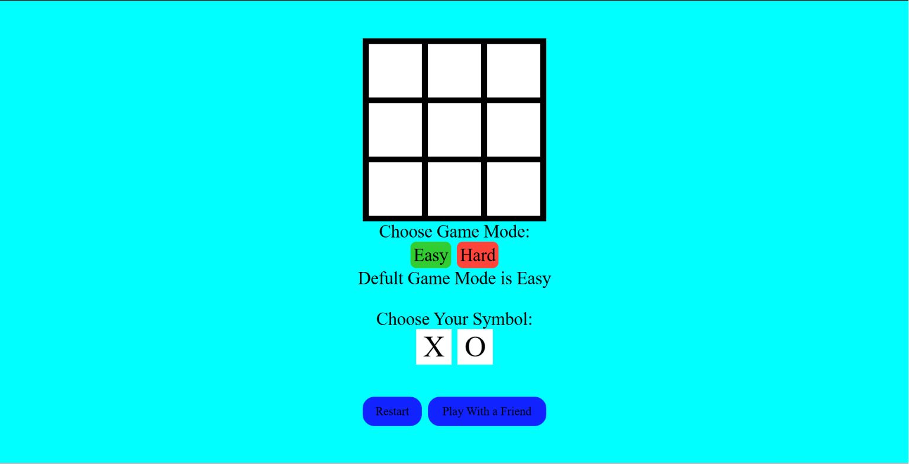
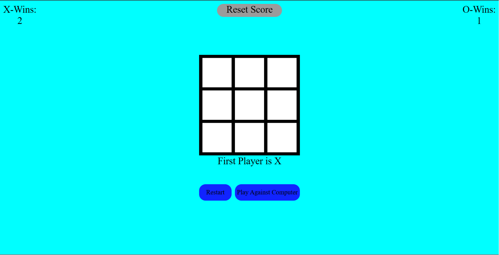

## TIC-TAC-TOE Game

This is a implementation of the tic tac toe game using HTML,CSS and JavaScript. In this game you can play agianst the computer with a easy mode and hard mode computer.

Player can also play with their friends on a same device with player mode. Player mode also has a scoreboard containing the wins of X and O and a reset score button which resets the X and O score to zero

---

## Features
- Functional tic tac toe game
- Choosing your own symbol(X or O)
- Play against the computer
- Play in easy and hard modes
- Play against player
- X and O win scores in player mode
- Reset score button to reset X and O score
- Restart game option
- Easily change Game Modes.

---

## Technologies Used
- HTML5
- CSS3
- JavaScript

---

## Use

Use this game through this link below:
https://tic-tac-toe-rajan.netlify.app/

---

## Author 

**Rajan Kandel**

GitHub: https://github.com/Rajandevs